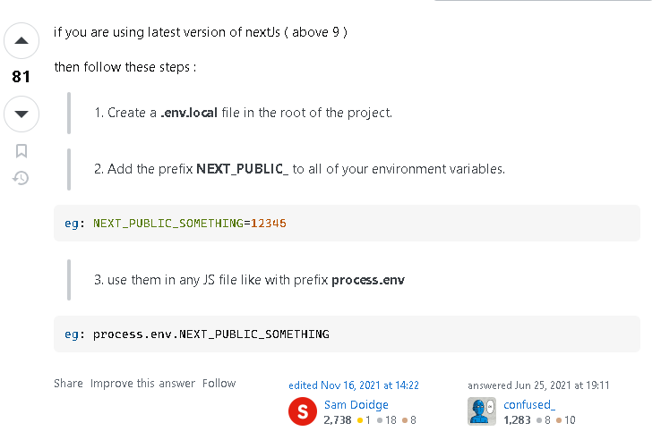

## Bugs

NEXT JS ENV VAR BUG


```
Create a .env.local file in the root of the project.
Add the prefix NEXT_PUBLIC_ to all of your environment variables.
eg: NEXT_PUBLIC_SOMETHING=12345
use them in any JS file like with prefix process.env
eg: process.env.NEXT_PUBLIC_SOMETHING


```


## AWS Cognito Sign in Error

Password Field was being entered as empty causing Cognito to intepret the bug as a custom auth lambda flow which needs custom config

After updating handlechange, the error went away and sign in flow was fixed

https://github.com/aws-amplify/amplify-js/pull/7401

```
    The error InvalidParameterException: Custom auth lambda trigger is not configured for the user pool suggests that the AWS Cognito User Pool is expecting a Lambda trigger for custom authentication flow, which has not been set up.
```


## Enable Email Verification in AWS Console

```
aws cognito-idp confirm-sign-up --client-id 3n4b5urk1ft4fl3mg5e62d9ado --username=diego@example.com --confirmation-code CONF_CODE
```
https://docs.aws.amazon.com/cli/latest/reference/cognito-idp/confirm-sign-up.html


## Next JS Query Params 

```
const createQueryString = useCallback(
      (name: string, value: string) => {
      const params = new URLSearchParams(searchParams)
      params.set(name, value)
      return params.toString()
    },
    [searchParams]
  )
  
```

## Current CheckPoint

https://github.com/omenking/aws-bootcamp-cruddur-2023/blob/week-3/journal/week3.md


## Add Recovery Page


## Add Sessions, Cookies, JWT Verification


## Write API, DB Design for Dms, live chat, notifications